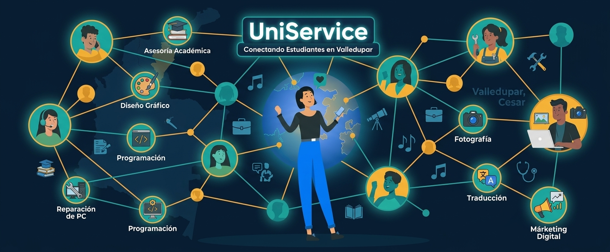

   
  <!-- LOGO -->
  

  <!-- ESLOGAN -->
  <h3><em>Convierte tu conocimiento en oportunidades.</em></h3>
  
<strong>La plataforma segura para el intercambio de servicios estudiantiles en Valledupar.</strong>

   

  <!-- STACK BADGES -->
  
  
  
  
    

<h2>📌 Objetivo del Proyecto</h2>

  <strong>UniService</strong> nace como una solución tecnológica para profesionalizar el intercambio de conocimientos y servicios dentro del ámbito universitario. El objetivo principal es erradicar la informalidad de los grupos de redes sociales, proporcionando un entorno centralizado donde los estudiantes pueden ofrecer tutorías, proyectos y asesorías técnicas de manera organizada y confiable.

<h2>👥 Público Objetivo</h2>
<ul>
  <li><strong>Estudiantes Prestadores:</strong> Estudiantes de ingeniería y otras facultades en Valledupar que buscan monetizar sus habilidades académicas o técnicas.</li>
  <li><strong>Estudiantes Usuarios:</strong> Miembros de la comunidad universitaria que requieren apoyo académico verificado y de calidad.</li>
  <li><strong>Comunidad Académica:</strong> Usuarios interesados en un repositorio de guías y material de estudio compartido.</li>
</ul>

<h2>🛠️ Desarrollo y Arquitectura</h2>

  El proyecto está construido bajo una arquitectura de <strong>Fullstack Javascript</strong>, optimizada para la escalabilidad y el despliegue rápido:

<ul>
  <li><strong>Frontend:</strong> Desarrollado con <strong>React 18</strong> y <strong>Vite</strong> para una interfaz de usuario ágil y reactiva. Se enfoca en componentes modulares y estilos limpios para una experiencia joven.</li>
  <li><strong>Backend:</strong> Una API robusta basada en <strong>Express 5</strong> que gestiona la lógica de autenticación, envío de correos mediante <strong>Nodemailer</strong> y el control de sesiones con <strong>JWT</strong>.</li>
  <li><strong>Base de Datos:</strong> Persistencia de datos gestionada en <strong>SQL Server 2025</strong>, asegurando integridad en las transacciones y en la información de los perfiles verificados.</li>
  <li><strong>Infraestructura:</strong> Implementación de contenedores con <strong>Docker</strong> para garantizar que el entorno de desarrollo sea idéntico al de producción.</li>
</ul>

<h2>🚀 Ejecución Rápida</h2>

Para poner en marcha el ecosistema completo de desarrollo:

<pre><code>npm run dev</code></pre>

<em>Este comando inicia automáticamente el backend (servidor) y el frontend (cliente) de forma simultánea.</em>

 

  

<h2 align="center">
  Hecho por estudiantes, para estudiantes. 🎓 
  Valledupar, Cesar, Colombia.
</h2>
